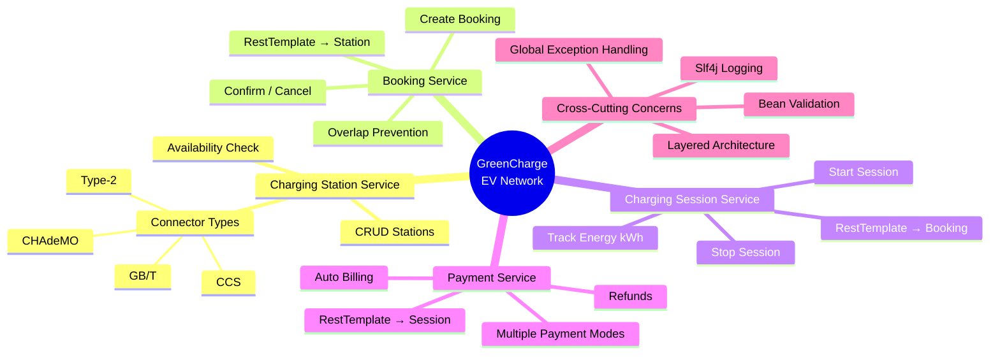
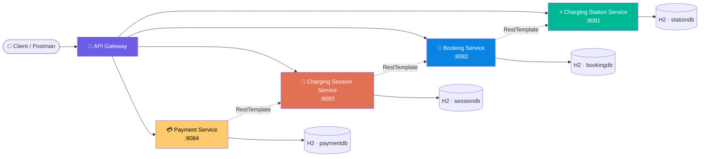
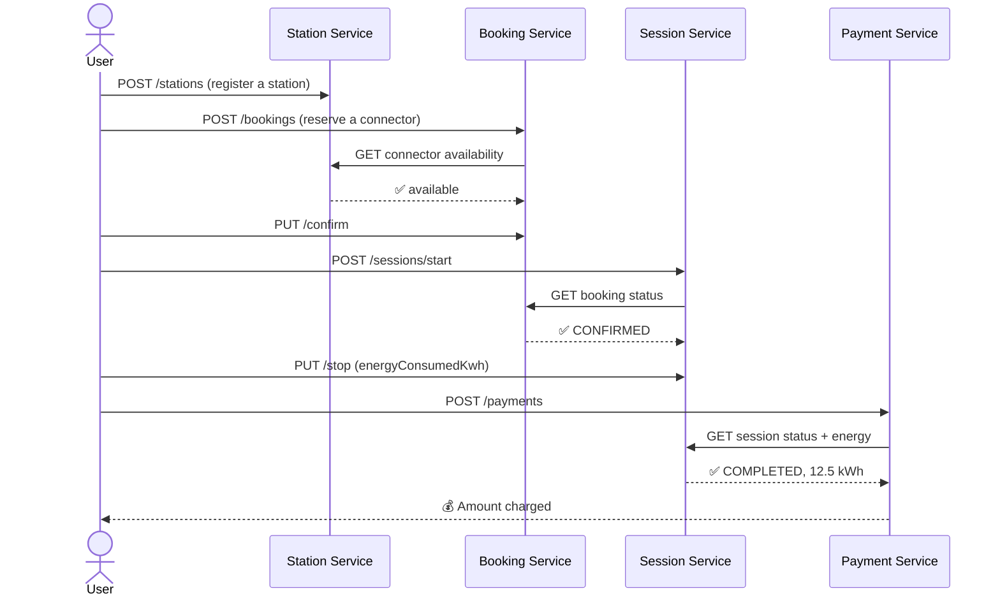

<div align="center">

# ⚡ GreenCharge — EV Charging Station Network

### A Microservices-based Capstone Project

*Book a slot. Plug in. Charge up. Pay seamlessly.*


</div>

---

## 🧠 Project Mindmap



---

## 🏗️ System Architecture



---

## 🔄 End-to-End Flow



---

## 📦 Microservices Overview

| # | Service | Port | Responsibility |
|---|---|:---:|---|
| 1 | ⚡ **Charging Station Service** | `8081` | Manage stations & connectors, CRUD, availability checks |
| 2 | 📅 **Booking Service** | `8082` | Reserve connectors, prevent double-booking, confirm/cancel |
| 3 | 🔌 **Charging Session Service** | `8083` | Start/stop a charging session, track energy consumed |
| 4 | 💳 **Payment Service** | `8084` | Bill the user based on energy consumed, process refunds |

Each service is fully independent — its own database, its own Maven build, its own port — and talks to the *previous* service in the chain via **RestTemplate**.

---

## 🛠️ Tech Stack

<div align="center">

| Layer | Technology |
|---|---|
| Language | Java 17 |
| Framework | Spring Boot 3.2.5 |
| Persistence | Spring Data JPA + H2 (in-memory) |
| Validation | Jakarta Bean Validation |
| Logging | Slf4j + Lombok `@Slf4j` |
| Inter-service Communication | RestTemplate |
| Build Tool | Maven |
| API Testing | Postman |

</div>

---

## 🧩 Layered Architecture (per service)

```
📁 <service-name>
 ┣ 📁 controller     → REST endpoints, request/response only
 ┣ 📁 service         → Business logic (interface + impl)
 ┣ 📁 repository      → Spring Data JPA repositories
 ┣ 📁 entity          → JPA entities & enums
 ┣ 📁 dto             → Request/response DTOs + validation
 ┣ 📁 client          → RestTemplate wrappers to other services
 ┣ 📁 config          → Bean configuration (RestTemplate, etc.)
 ┗ 📁 exception       → Custom exceptions + @ControllerAdvice
```

Every method across every service starts with:
```java
log.info("I am inside the method: methodName");
```
so the console tells a clear story of the request as it flows through the layers.

---

## ✅ Features Implemented

- 🏗️ **Well-designed Repository pattern** across all 4 services
- 🔧 **Full CRUD operations** for stations, bookings, sessions, payments
- 🛡️ **Request validation** using Bean Validation (`@NotNull`, `@NotBlank`, `@Positive`, `@Future`, …)
- 🚨 **Centralized exception handling** via `@ControllerAdvice` — every error returns a consistent JSON shape
- 📝 **Structured logging** with `@Slf4j` on every class and method
- 🔗 **Inter-service communication** using RestTemplate (Booking → Station, Session → Booking, Payment → Session)
- ⛔ **Business rule enforcement**: no double-booking, no duplicate active sessions, no duplicate payments
- 💾 **H2 in-memory database** with web console for quick inspection

---

## 🚀 Getting Started

### Prerequisites
- Java 17+
- Maven 3.8+
- Postman (for testing)

### Run all services (in this order!)

```bash
# Terminal 1
cd ev-charging-station-service && mvn spring-boot:run   # :8081

# Terminal 2
cd booking-service && mvn spring-boot:run                 # :8082

# Terminal 3
cd session-service && mvn spring-boot:run                  # :8083

# Terminal 4
cd payment-service && mvn spring-boot:run                   # :8084
```

### H2 Console access

| Service | Console URL | JDBC URL |
|---|---|---|
| Station | `localhost:8081/h2-console` | `jdbc:h2:mem:stationdb` |
| Booking | `localhost:8082/h2-console` | `jdbc:h2:mem:bookingdb` |
| Session | `localhost:8083/h2-console` | `jdbc:h2:mem:sessiondb` |
| Payment | `localhost:8084/h2-console` | `jdbc:h2:mem:paymentdb` |

User: `sa` · Password: *(blank)*

---

## 📮 API Endpoints Summary

<details>
<summary><b>⚡ Charging Station Service (8081)</b></summary>

| Method | Endpoint | Description |
|---|---|---|
| POST | `/stations` | Create a station |
| GET | `/stations` | List all (optional `?city=`) |
| GET | `/stations/{id}` | Get by id |
| PUT | `/stations/{id}` | Update |
| DELETE | `/stations/{id}` | Delete |
| GET | `/stations/{id}/connectors/{cid}/available` | Check connector availability |

</details>

<details>
<summary><b>📅 Booking Service (8082)</b></summary>

| Method | Endpoint | Description |
|---|---|---|
| POST | `/bookings` | Create a booking |
| GET | `/bookings` | List all (optional `?userId=`) |
| GET | `/bookings/{id}` | Get by id |
| PUT | `/bookings/{id}/confirm` | Confirm booking |
| PUT | `/bookings/{id}/cancel` | Cancel booking |
| DELETE | `/bookings/{id}` | Delete |

</details>

<details>
<summary><b>🔌 Charging Session Service (8083)</b></summary>

| Method | Endpoint | Description |
|---|---|---|
| POST | `/sessions/start` | Start a session for a confirmed booking |
| PUT | `/sessions/{id}/stop` | Stop a session, record energy consumed |
| PUT | `/sessions/{id}/terminate` | Force-end a session |
| GET | `/sessions` | List all (optional `?userId=`) |
| GET | `/sessions/{id}` | Get by id |

</details>

<details>
<summary><b>💳 Payment Service (8084)</b></summary>

| Method | Endpoint | Description |
|---|---|---|
| POST | `/payments` | Charge for a completed session |
| PUT | `/payments/{id}/refund` | Refund a payment |
| GET | `/payments` | List all (optional `?userId=`) |
| GET | `/payments/{id}` | Get by id |

</details>

---

## 🧪 Testing with Postman

A ready-to-import **Postman Collection** is included, with multiple sample payloads for every endpoint (different stations, users, payment methods, etc.), plus a step-by-step guide covering the full flow from station creation to payment.

```
📄 ev-charging-network.postman_collection.json
📄 postman-testing-guide.md
```
## Output
### PostMan:
### Charging Station Service


### Booking Service


### Charging Session Service


### Payment Service


### H2 Console
### Charging Station Service


### Booking Service


### Charging Session Service


### Payment Service


---

<div align="center">

### 🌱 Built as part of the EV Charging Station Network Capstone Project

*Well-designed Repository • CRUD • Validation • Exception Handling • Logging • REST-based Microservices*

</div>
